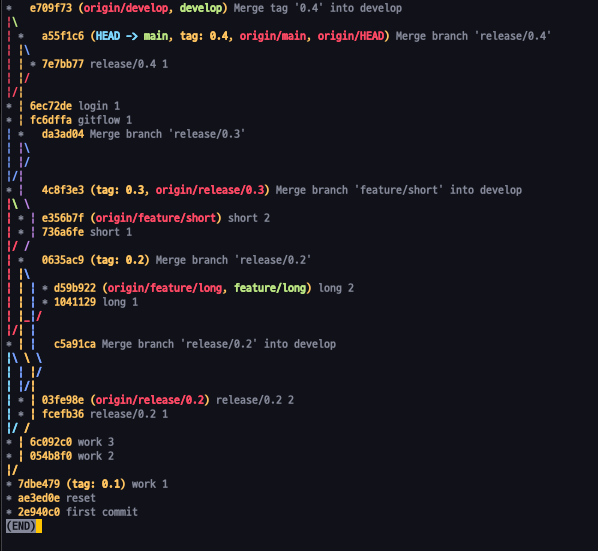

## git basic


- 생성
```
$ git init
$ git add .
$ git commit -m 'first commit'
```
- 확인
```
$ git status
$ git log 
$ git log -p 
$ git log --stat
$ git diff
```
- Git 기본
```
main(master): 기본 브랜치
origin: 기본 리모트 저장소
HEAD: 현재 브랜치
HEAD^: 현재의 부모
HEAD~2: 현재의 부모의 부모
```

- 되돌리기
```
$ git reset <version> # 해당 버전으로 되돌리기 윗 버전들은 삭제
 --mixed: 취소 내용을 working directory에
 --soft: 취소 내용을 staging area에
 --hard: 취소 내용 버림
$ git push -f origin main # 협업 시에는 주의하여 사용 

$ git revert <version> # 해당 버전의 마지막 커밋 내용을 되돌리고 다시 커밋, 순차적으로만 revert 가능
$ git revert <version>..<version> 여러개 버전 revert 예) git revert 001..003 일 경우 003, 002, 001 순으로 revert 
```

- 브랜치
```
$ git branch
$ git log --all -graph --oneline

$ git branch apple
$ git checkout apple
...
$ git checkout main
$ git merge apple
```

- 백업
```
$ git remote add origin https://github.com/allwriter/git.git
$ git branch -M main
$ git remote
$ git push -u origin main
```

- 복원
```
$ git clone https://github.com/allwriter/git.git
$ git pull origin main
```

- git merge tool
```
$ git config --global merge.tool p4mergetool
$ git config --global mergetool.p4mergetool.cmd \
"/Applications/p4merge.app/Contents/Resources/launchp4merge \$PWD/\$BASE \$PWD/\$REMOTE \$PWD/\$LOCAL \$PWD/\$MERGED"
$ git config --global mergetool.p4mergetool.trustExitCode false
$ git config --global mergetool.keepBackup false
$ git mergetool
```
- git pull의 다른 방법
```
신중하게 가져오고 싶을 때
$ git fetch 
$ git merge FETCH_HEAD
```
- cherry-pick
```
원하는 것만 가져오기
$ git cherry-pick {version}
```

- rebase
```
base를 옮겨 선형 로그로 만든다 (원격 저장소에 push하기 전에만 사용.. 혼란을 줄 수도)
$ git rebase {이동하려는 branch name}
```

- git credential
```
$ git config --global credential.helper                   # .git-credentails에 저장
$ git config --global credential.helper osxkeychain       # 키체인에 저장 
$ git config --global --unset credential.helper           # 원복 
```

- branch local -> remote
```
$ git checkout -b develop
$ git push -u origin develop
...
$ git push

$ git checkout master
$ git merge develop
$ git push
...
```
- remote branch 삭제
```
(master) git branch --delete develop (git branch -D develop)
git push origin :develop
```

- 확인하면서 add 하기
```
git add . -p
```


## git flow

- 0.1 출시
```
$ vi main.txt # 1
$ git add .
$ git commit -m 'work 1'
$ git tag 0.1 
$ git push -u origin main
$ git push origin 0.1
```

- develop
```
$ git checkout -b develop
$ git push -u origin develop
$ vi main.txt # 1,2
$ git commit -am 'work 2'
$ git push
$ vi main.txt # 1,2,3
$ git commit -am 'work 3'
$ git push
```

- release/0.2 
```
$ git checkout -b release/0.2
$ git push -u origin release/0.2

# bugfix
$ vi release.txt # 1
$ git add .
$ git commit -m 'release/0.2 1'
$ git push
$ vi release.txt # 1,2
$ git commit -am 'release/0.2 2'
$ git push

$ git checkout develop
$ git merge --no-ff release/0.2
$ git push
```

- 0.2 출시
```
$ git checkout main
$ git merge --no-ff release/0.2
$ git tag 0.2
$ git push
$ git push origin 0.2
$ git branch -D release/0.2 
```


- feature
```
$ git checkout develop
$ git checkout -b feature/short # 0.3에 배포할 기능
$ git push -u origin feature/short

$ git checkout develop
$ git checkout -b feature/long # 0.4에 배포할 기능
$ git push -u origin feature/long

$ git checkout feature/short
$ vi short.txt # 1
$ git add .
$ git commit -m 'short 1'
$ git push
$ vi short.txt # 1,2
$ git commit -am 'short 2'
$ git push

$ git checkout feature/long
$ vi long.txt # 1
$ git add .
$ git commit -m 'long 1'
$ git push
$ vi long.txt # 1,2
$ git commit -am 'long 2'
$ git push
```
- develop
```
$ git checkout develop
$ git merge --no-ff feature/short
$ git push
$ git branch -D feature/short 
```

- release/0.3
```
$ git checkout -b release/0.3
$ git push -u origin release/0.3
$ vi short.txt #1,2,bugfix
$ git commit -am 'release/0.3 1'
$ git push

$ git checkout develop
$ git merge --no-ff release/0.3
```

- 0.3 출시
```
$ git checkout main
$ git merge --no-ff release/0.3
$ git tag 0.3
$ git push
$ git push origin 0.3
$ git branch -D release/0.3 
```

- hotfixes
```
$ git checkout -b hotfixes/0.3.1
...
$ git checkout develop
$ git merge --no-ff hotfixes/0.3.1
$ git push

$ git checkout main
$ git merge --no-ff hotfixes/0.3.1
$ git tag 0.3.1
$ git push
$ git push origin 0.3.1
$ git branch -D hotfixes/0.3.1
```

### 참고


## git flow cli
https://danielkummer.github.io/git-flow-cheatsheet/index.ko_KR.html
- develop
```
$ git flow init
$ git checkout develop
$ vi gitflow.txt # 1
$ git add .
$ git commit -m 'gitflow 1'
$ git push

```

- feature 
```
$ git flow feature start login
$ vi login.txt # 1
$ git add .
$ git commit -m 'login 1'
$ git flow feature publish login
$ git flow feature finish login 
$ git push
```

- release/0.4
```
$ git flow release start 0.4
$ vi release2.txt # 1
$ git add .
$ git commit -m 'release/0.4 1'
$ git flow release publish 0.4
$ git flow release finish 0.4
$ git push
```

- 0.4 출시
```
$ git checkout main
$ git push
$ git push origin 0.4
```



